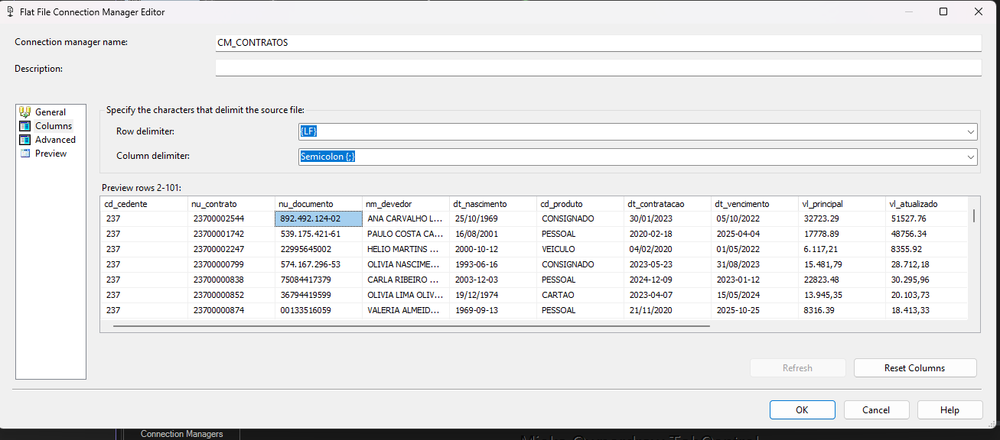
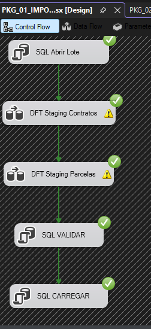
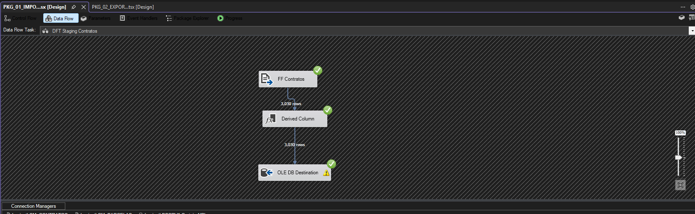
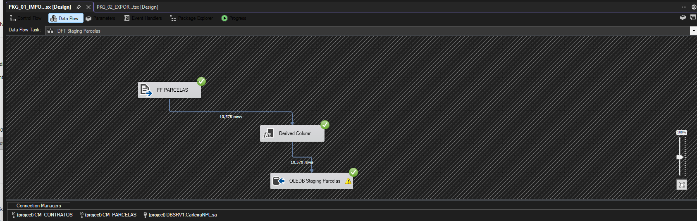
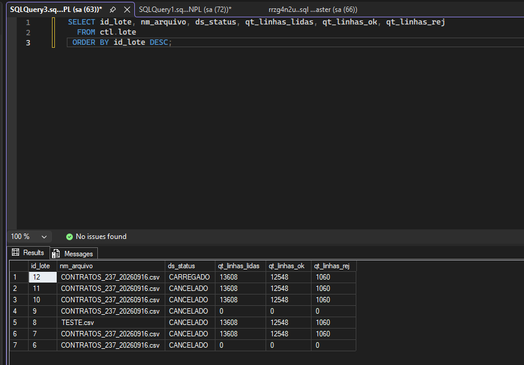
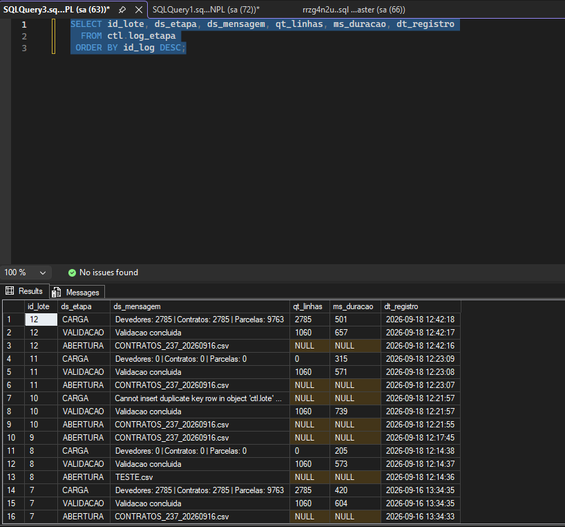
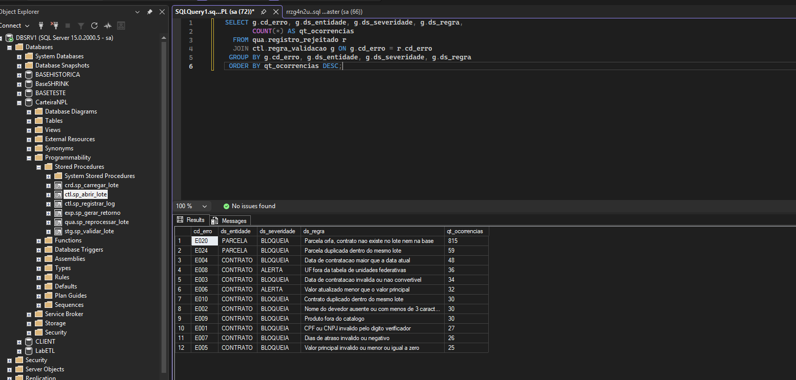
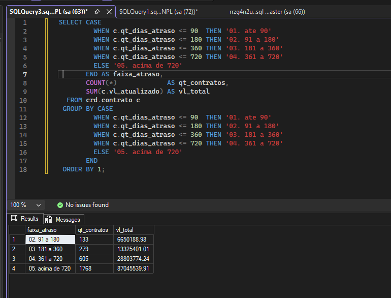
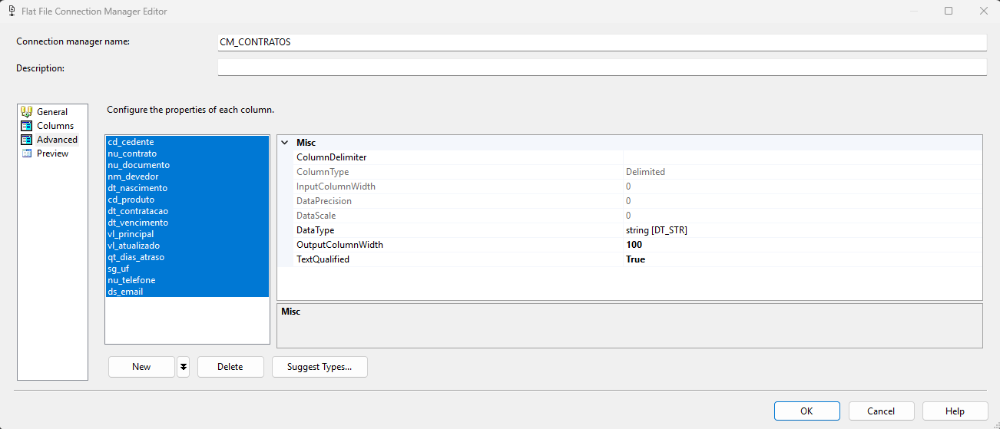

# Pipeline ETL de arquivos bancários em SQL Server e SSIS

Laboratório de ETL que simula a ingestão diária de arquivos enviados por bancos parceiros: importar, validar, carregar de forma incremental e devolver um arquivo de retorno ao remetente. O domínio usado é carteira de crédito inadimplente (NPL), o mesmo cenário de empresas de recuperação de crédito.

> Projeto de estudo. Todos os dados são gerados sinteticamente, nenhum dado real é utilizado.

**Stack:** SQL Server 2019, T-SQL, SSIS (Visual Studio 2026), Python

---

## O problema

Uma empresa que compra carteiras inadimplentes recebe diariamente arquivos de vários cedentes. Cada arquivo traz milhares de contratos com formatos inconsistentes.



Repare no mesmo arquivo: CPF ora com máscara (`892.492.124-02`), ora sem (`22995645002`). Data ora em `25/10/1969`, ora em `1993-06-16`. Valor ora com ponto decimal (`32723.29`), ora com vírgula (`15.481,79`). Somam-se a isso contratos duplicados e parcelas apontando para contratos que não existem.

Carregar isso direto na base de negócio gera cobrança indevida. Rejeitar o arquivo inteiro por causa de 8% de linhas ruins trava a operação.

A solução é um pipeline que separa o que é confiável do que não é, sem perder nada pelo caminho.

---

## O fluxo



```
arquivo do cedente
        |
        v
  [ ctl.sp_abrir_lote ]          abre o lote, barra arquivo já carregado
        |
        v
  [ SSIS Data Flow ]             move texto puro para o staging, sem converter
        |
        v
  stg.contrato_carteira / stg.parcela_contrato
        |
        v
  [ stg.sp_validar_lote ]        15 regras cadastradas em tabela
        |
        +--- BLOQUEIA --> qua.registro_rejeitado   (quarentena, reprocessável)
        |
        v  ALERTA ou OK
  [ crd.sp_carregar_lote ]       MERGE por chave natural, idempotente
        |
        v
  crd.devedor / crd.contrato / crd.parcela
        |
        v
  [ exp.sp_gerar_retorno ]       arquivo de retorno com desfecho por linha
```

### Os Data Flow

O papel do SSIS aqui é transporte e orquestração. Cada Data Flow tem três componentes: Flat File Source lendo texto puro, Derived Column acrescentando o `id_lote` gerado pelo banco, e OLE DB Destination em modo fast load.





---

## Resultado de uma execução

| Métrica | Valor |
|---|---|
| Linhas processadas | 13.608 |
| Aceitas | 12.548 |
| Rejeitadas | 1.060 |
| Devedores carregados | 2.785 |
| Contratos carregados | 2.785 |
| Parcelas carregadas | 9.763 |
| Tempo da carga | 501 ms |



### Idempotência

Esta é a demonstração mais importante do projeto. Na imagem abaixo, o lote 12 carrega 2.785 contratos e 9.763 parcelas. O lote 11 processou exatamente o mesmo arquivo e gravou zero.



Não é falha. O `MERGE` identifica cada registro pela chave natural (`cd_cedente` + `nu_contrato`), encontra tudo já cadastrado e não insere nada. Rodar o mesmo arquivo duas vezes não duplica a carteira.

A cláusula que garante isso:

```sql
WHEN MATCHED AND EXISTS (
        SELECT alvo.id_devedor, alvo.vl_atualizado, alvo.qt_dias_atraso
        EXCEPT
        SELECT org.id_devedor,  org.vl_atualizado,  org.qt_dias_atraso)
    THEN UPDATE SET ...
```

Sem ela, todo registro do arquivo receberia `UPDATE` mesmo sem nada ter mudado. Em carteira de milhões de linhas isso significa log de transação enorme e fragmentação de índice diária, sem uma única alteração real de dado. O `EXCEPT` compara conjuntos e trata `NULL` corretamente, o que `<>` não faz.

### Qualidade da ingestão



Este é o relatório mais útil da operação. Quando um motivo dispara de repente, quase sempre significa que o cedente mudou o layout sem avisar.

O `E020` (parcela órfã) aparece 815 vezes por efeito cascata: quando um contrato é bloqueado, as parcelas dele ficam sem pai e são rejeitadas junto. É a regra impedindo que entre parcela sem contrato na base.

### Visão de negócio



Aging é a visão clássica de carteira inadimplente: quanto mais antigo o atraso, menor a expectativa de recuperação, e é isso que define a precificação do ativo.

---

## Decisões técnicas

| Decisão | Por quê |
|---|---|
| Staging com todas as colunas em `VARCHAR` | Conversão é regra de negócio. Uma data mal formatada vira rejeição rastreável, não pacote abortado. |
| Regra de negócio em T-SQL, fora do Data Flow | T-SQL é versionável, revisável em pull request e legível sem abrir o Visual Studio. Regra dentro do Data Flow vira caixa preta: o diff no Git é XML ilegível. |
| Regras de validação em tabela (`ctl.regra_validacao`) | Severidade é dado, não código. Mudar uma regra de `ALERTA` para `BLOQUEIA` é um `UPDATE`, não um deploy. |
| Quarentena em vez de descarte | Registro rejeitado é insumo para o time de negócio corrigir a origem. |
| `MERGE` por chave natural | Carga incremental idempotente, preservando chave substituta e histórico de inclusão. |
| Índice único filtrado em `ctl.lote` | Barra o reprocessamento acidental antes de qualquer linha entrar no staging. |
| Todas as colunas do flat file como `DT_STR` largura 100 | Se o SSIS inferir tipos, o primeiro arquivo com data ruim derruba o package inteiro. |



---

## Regras de validação implementadas

**Contrato:** documento inválido pelo dígito verificador, nome ausente, data de contratação não convertível, data de contratação no futuro, valor principal inválido, valor atualizado menor que o principal (alerta), dias de atraso negativo, UF desconhecida (alerta), produto fora do catálogo, contrato duplicado no lote.

**Parcela:** parcela órfã sem contrato correspondente, vencimento inválido, valor inválido, número de parcela inválido, parcela duplicada no lote.

---

## Estrutura

```
sql/01_estrutura.sql              banco, schemas, tabelas, seed das regras
sql/02_functions.sql              validação de CPF/CNPJ, conversão defensiva
sql/03_procedures.sql             abertura de lote, validação, MERGE, exportação
sql/04_carga_manual_e_testes.sql  carga via BULK INSERT e consultas de conferência
<<<<<<< HEAD
=======
ssis/CarteiraNPL/                 projeto do Visual Studio com o package
>>>>>>> 2cd951b (Atualiza README com imagens e resultados da execucao)
gerador/gerar_carteira.py         gera arquivos sintéticos com defeitos propositais
docs/                             passo a passo do SSIS e imagens
```

Todos os scripts são comentados explicando o que cada bloco faz, por que foi feito daquele jeito e qual alternativa foi descartada.

---

## Como rodar

Requisitos: SQL Server 2017 ou superior (usa `STRING_AGG`), Python 3.8+, e Visual Studio com a extensão SQL Server Integration Services Projects 2022+ para a parte de SSIS.

```bash
# 1. Gerar a massa de teste
cd gerador
python gerar_carteira.py --contratos 3000 --defeitos 0.10 --cedente 237
```

```sql
-- 2. No SSMS, na ordem
:r sql\01_estrutura.sql
:r sql\02_functions.sql
:r sql\03_procedures.sql
<<<<<<< HEAD

-- 3. Carga e conferência (ajuste o caminho da pasta no início do script)
:r sql\04_carga_manual_e_testes.sql

Para a versão com SSIS, ver `docs/02-ssis-passo-a-passo.md`.
=======
```

Para executar pelo SSIS, abra o projeto em `ssis/CarteiraNPL`, ajuste o connection manager para a sua instância e os connection managers de flat file para o caminho dos CSV gerados.
>>>>>>> 2cd951b (Atualiza README com imagens e resultados da execucao)

O script `04_carga_manual_e_testes.sql` executa o mesmo pipeline via `BULK INSERT`, sem depender do SSIS. Útil para testar toda a lógica T-SQL isoladamente.

<<<<<<< HEAD
**Contrato**: documento inválido pelo dígito verificador, nome ausente, data de contratação não convertível, data de contratação no futuro, valor principal inválido, valor atualizado menor que o principal (alerta), dias de atraso negativo, UF desconhecida (alerta), produto fora do catálogo, contrato duplicado no lote.

**Parcela**: parcela órfã sem contrato correspondente, vencimento inválido, valor inválido, número de parcela inválido, parcela duplicada no lote.
=======
---

## Limitações conhecidas

- As funções escalares de validação usadas em predicado do `WHERE` limitam paralelismo. O SQL Server 2019 mitiga parte disso com scalar UDF inlining, mas em volume alto a abordagem seria materializar as colunas convertidas numa única passada ou usar função inline com valor de tabela.
- O `MERGE` em cargas de altíssima concorrência tem comportamentos documentados que exigem cuidado. Para volume industrial, vale comparar com `UPDATE` e `INSERT` separados.
- O caminho de reprocessamento não está completo: o parâmetro `@fl_forcar` permite reabrir um lote já carregado, mas o índice único filtrado barra o commit final. Em produção, o reprocessamento legítimo exigiria cancelar o lote anterior explicitamente.
- Não há particionamento nem estratégia de expurgo do staging.
- O package processa um arquivo por execução, sem Foreach Loop varrendo o diretório de entrada.

---

## Próximos passos

- Package de exportação do arquivo de retorno ao cedente
- Event handler `OnError` gravando em `ctl.log_etapa`
- Foreach Loop Container varrendo o diretório de entrada
- Camada analítica e dashboard para acompanhar carteira e qualidade da ingestão
